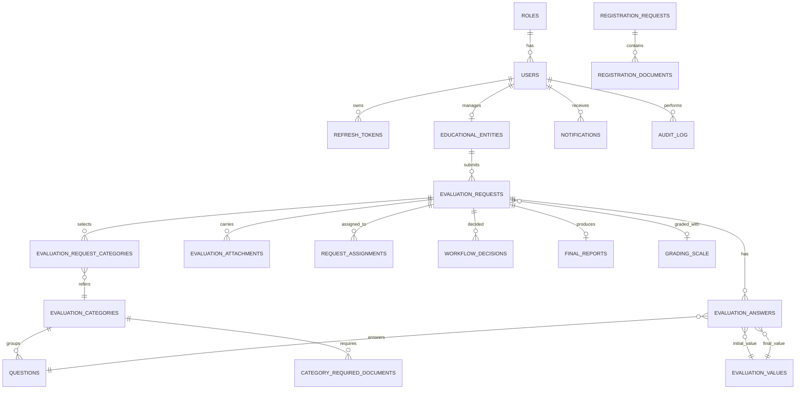

# Diagramme Entité-Relation (ERD)

> Représentation textuelle du modèle de données — voir `schema.sql` pour le DDL exécutable.

## Vue d'ensemble — les 11 domaines

```
┌──────────────────────────────────────────────────────────────────────────┐
│           PROFILS MÉTIER  (auth déléguée à Keycloak)                     │
│   roles ─────────┐                                                       │
│                  └──► users (kc_id ◄──► Keycloak user UUID)              │
│                                                                          │
│   ⚠ Pas de password_hash ni refresh_tokens ici : Keycloak gère.          │
└──────────────────────────────────────────────────────────────────────────┘
              │
              ▼
┌──────────────────────────────────────────────────────────────────────────┐
│                          INSTITUTIONS                                    │
│   registration_requests ─► registration_documents                        │
│              │                                                           │
│              ▼ (après approbation, crée)                                 │
│   educational_entities ◄─── users (manager_user_id)                      │
└──────────────────────────────────────────────────────────────────────────┘
              │
              ▼
┌──────────────────────────────────────────────────────────────────────────┐
│                   CATALOGUE (paramétrable Admin)                         │
│   evaluation_categories ──► questions                                    │
│            │              ─► category_required_documents                 │
│            ▼                                                             │
│   evaluation_values  (A=4 / B=3 / C=2 / D=1)                             │
│   grading_scale      (échelle de classement %)                           │
└──────────────────────────────────────────────────────────────────────────┘
              │
              ▼
┌──────────────────────────────────────────────────────────────────────────┐
│                       DEMANDES D'ÉVALUATION                              │
│   evaluation_requests ──► evaluation_request_categories ──► categories   │
│            │            ─► evaluation_answers ──► questions              │
│            │                       │                                     │
│            │                       └──► evaluation_values (init+final)   │
│            ├──► evaluation_attachments                                   │
│            ├──► request_assignments (3 stages)                           │
│            ├──► workflow_decisions (3 stages)                            │
│            └──► final_reports                                            │
└──────────────────────────────────────────────────────────────────────────┘
              │
              ▼
┌──────────────────────────────────────────────────────────────────────────┐
│                       TRANSVERSAL                                        │
│   notifications  (par utilisateur)                                       │
│   audit_log      (immutable, indexé sur user/entity/date)                │
│   system_settings (clé/valeur)                                           │
└──────────────────────────────────────────────────────────────────────────┘
```

## Cardinalités principales

| Relation | Cardinalité | Note |
|----------|-------------|------|
| roles → users | 1..N | Un rôle peut avoir plusieurs utilisateurs |
| users → educational_entities | 1..1 | Un manager = une seule Jiha |
| evaluation_categories → questions | 1..N | Une catégorie regroupe N questions |
| evaluation_requests ↔ evaluation_categories | M..N | Via table de jointure |
| evaluation_requests → evaluation_answers | 1..N | Une réponse par question choisie |
| evaluation_requests → workflow_decisions | 1..3 | Max 3 décisions (init, admin, field) |
| evaluation_requests → final_reports | 1..1 | Un rapport final par demande |
| users → notifications | 1..N | Plusieurs notifications par user |
| users → audit_log | 1..N | Toute action est tracée |

## Diagramme par tables (style Mermaid pour outils compatibles)



## Choix de conception expliqués

### Pourquoi `initial_value_id` ET `final_value_id` séparés dans `evaluation_answers` ?
Le cahier des charges (Feature 9) exige que la note auto-attribuée par l'institution soit **conservée** à côté de la note ajustée par l'évaluateur. C'est crucial pour la traçabilité et l'audit. Les deux colonnes pointent vers `evaluation_values`.

### Pourquoi `audit_log` autorise `user_id NULL` ?
Pour journaliser les **tentatives de login échouées** (l'utilisateur n'est pas encore identifié) — `user_email` capture l'email tenté.

### Pourquoi `final_score` figé sur `evaluation_requests` au lieu de recalculer ?
- **Performance** : pas besoin de joindre 4 tables à chaque affichage
- **Immutabilité** : une fois `APPROVED_FINAL`, le score ne doit pas changer même si on modifie la pondération en BDD plus tard
- **Cohérence** : le rapport PDF doit toujours montrer la même note

### Pourquoi `is_locked` sur `evaluation_requests` ?
Verrou applicatif : passé à `TRUE` après `PENDING_ADMIN`. Toute mutation est rejetée par le service avant même de toucher la BDD.

### Pourquoi des vues SQL (`v_request_summary`, `v_category_avg_score`) ?
Simplifient les requêtes du dashboard analytique sans dupliquer la logique dans le code Java.

## Notes pour la migration Flyway

Le schéma est livré comme un seul fichier ; pour Flyway il sera découpé en migrations versionnées :
- `V1__init_roles_and_users.sql`
- `V2__init_entities.sql`
- `V3__init_catalog.sql`
- `V4__init_requests_and_workflow.sql`
- `V5__init_audit_and_notifications.sql`
- `V6__init_views_and_settings.sql`

Cette découpe est faite plus tard quand on intègre Flyway au projet Spring Boot.
